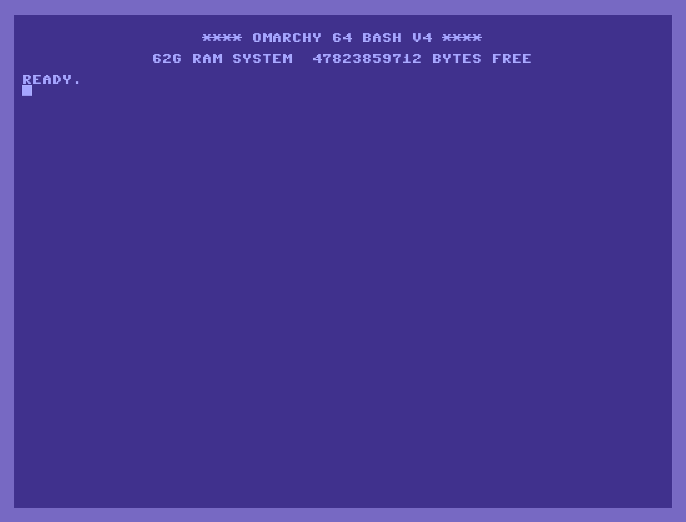

# OMARCHY 64

An easter egg terminal for [Omarchy](https://omarchy.org/).

Type `c64`. A Commodore 64 drops onto your desktop.



## Install

User-space only. No sudo, no packages, no theme switch.

```bash
git clone https://github.com/Ojisan1/omarchy-64.git
cd omarchy-64
./install.sh
```

Then, from a normal terminal:

```bash
c64
```

A 4:3 CRT floats in the middle of the screen — chunky C64 Pro Mono, VIC-II blues, and a boot banner with *your* RAM instead of `38911 BASIC BYTES FREE`. Super+Enter is unchanged. `exit` or Ctrl+D closes the CRT; nothing leaks into other terminals.

Super+T tiles the float if you want it docked. Super+F maximizes.

## Uninstall

```bash
./uninstall.sh
```

## What it is not

Not an Omarchy theme. Osaka Jade (or whatever you use) stays. Super+Enter, `omarchy launch tui`, and the rest of the desktop are untouched. Only windows launched with `c64` get the blue screen.

## License

Scripts and config in this repo are [MIT](LICENSE).

**C64 Pro Mono** is © 2010–2019 [Style](http://style64.org/c64-truetype). The installer fetches it from style64.org into `~/.local/share/fonts/c64/` and does not rehost the font. Their [license](third_party/C64_TrueType_LICENSE.txt) allows including it in a freely provided software package and forbids selling or redistributing the font as a font collection. Do not sell the font.

JetBrainsMono Nerd Font is already on Omarchy and is used only as a glyph fallback.
